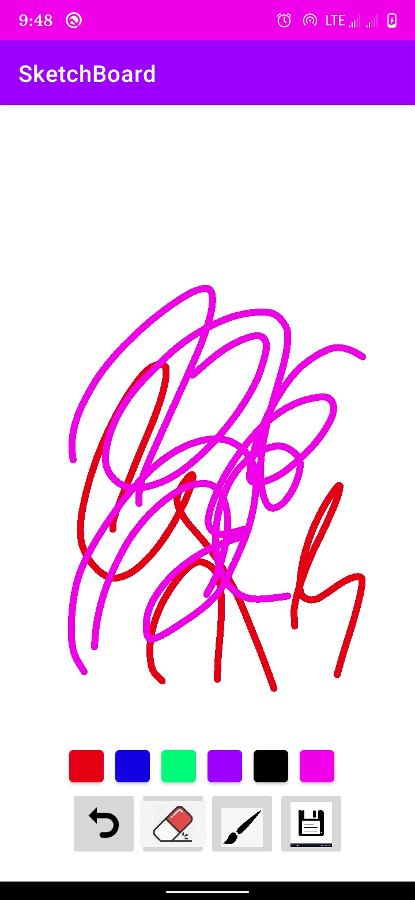
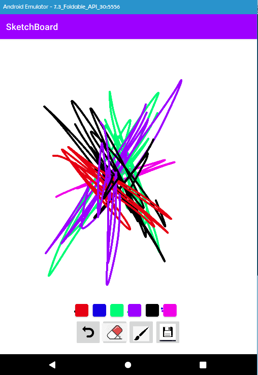

# Sketch-Board
A simple drawing application with canvas and paint class in kotlin.

# To run
1. Clone the repository and open it in android studio.
2. Dependencies will get installed and after that green play button on the top will get enabled.
3. Run it by pressing the green play button and voila.

# Screenshots
 
 
 
# Features included
This is just an initial version of this application.
Six colors are there.
Undo option is provided.
Drawings can also be saved locally in the Download folder 
